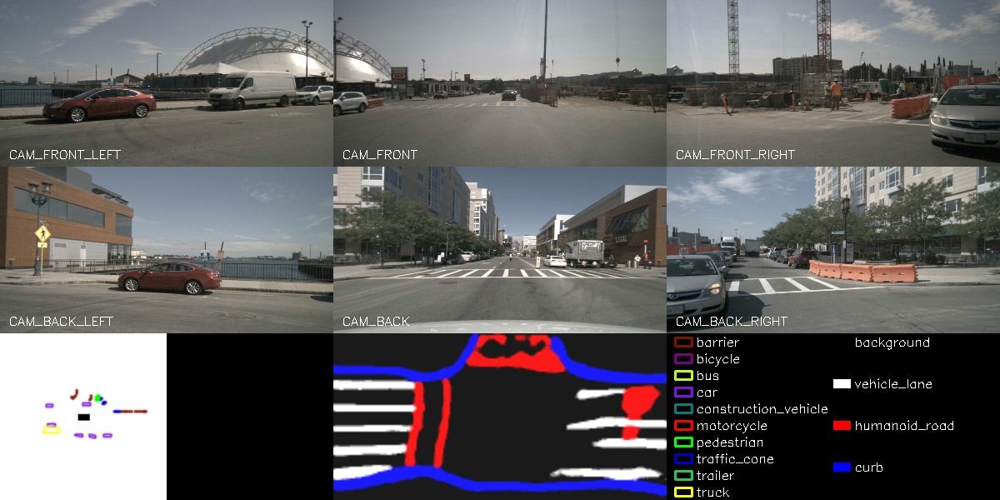

Getting Started with Hobot Bev Node
=======


# 功能介绍


# 开发环境

- 编程语言: C/C++
- 开发平台: J5/X86
- 系统版本：Ubuntu 20.0.4
- 编译工具链:Linux GCC 9.3.0/Linaro GCC 9.3.0

# 编译

- J5版本：支持在J5 Ubuntu系统上编译和在PC上使用docker交叉编译。
- X86版本：支持在X86 Ubuntu系统上编译。

## J5 Ubuntu系统上编译 J5版本

1、编译环境确认

- 板端已安装J5 Ubuntu系统。

- 当前编译终端已设置TROS·B环境变量：`source /opt/tros/setup.bash`。

- 已安装ROS2软件包构建系统ament_cmake。安装命令：`apt update; apt-get install python3-catkin-pkg; pip3 install empy`

- 已安装ROS2编译工具colcon。安装命令：`pip3 install -U colcon-common-extensions`

2、编译

- 编译命令：`colcon build --packages-select hobot_bev`

## docker交叉编译 J5版本

1、编译环境确认

- 在docker中编译，并且docker中已经编译好TROS·B。docker安装、交叉编译、TROS·B编译和部署说明详见[地平线机器人平台用户手册](https://developer.horizon.ai/api/v1/fileData/TogetherROS/quick_start/cross_compile.html#togetherros)。

2、编译

- 编译命令：

  ```shell
  bash robot_dev_config/build.sh -p J5 -s hobot_bev
  ```

# 使用介绍

## 参数

  this->declare_parameter<std::string>("config_file", config_file_);
  this->declare_parameter<std::string>("model_file", model_file_);
  this->declare_parameter<std::string>("pkg_path", pkg_path_);
  this->declare_parameter<std::string>("image_pre_path", image_pre_path_);


| 字段 | 类型 | 描述 | 默认值 |
| ---- | ---- | ---- | ---- |
| config_file | string | 配置文件路径 | "config/bev_ipm_base/bev_ipm_base_config.json" |
| model_file | string | 模型文件路径 | "config/model/model-c359f50c.hbm" |
| pkg_path | string | pkg安装路径 | launch脚本中自动获取 |
| image_pre_path | string | 回灌数据集所在路径 | 无 |

## J5 Ubuntu系统上运行

**准备回灌数据集**

```shell
# 板端下载数据集
wget http://archive.sunrisepi.tech/TogetheROS/data/hobot_bev_data.tar.gz

# 解压缩
mkdir hobot_bev_data
tar -zxvf hobot_bev_data.tar.gz -C hobot_bev_data

# 解压完成后数据集在hobot_bev_data/data路径下
```

**使用本地数据集回灌**

```shell
# 配置TogetheROS·Bot环境
source /opt/tros/setup.bash

# 启动运行脚本，并指定数据集路径
ros2 launch hobot_bev hobot_bev.launch.py image_pre_path:=hobot_bev_data/data
```

PC的WEB端输入板端IP地址`http://IP:8000`，展示回灌结果和实时渲染：

